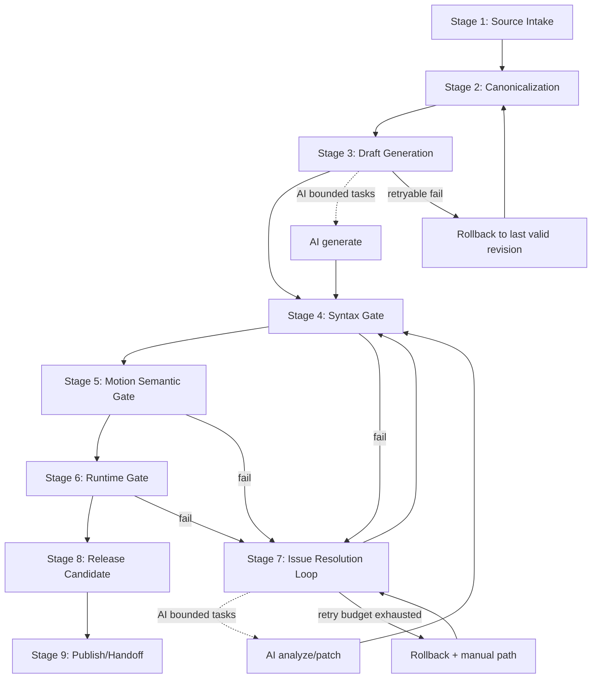
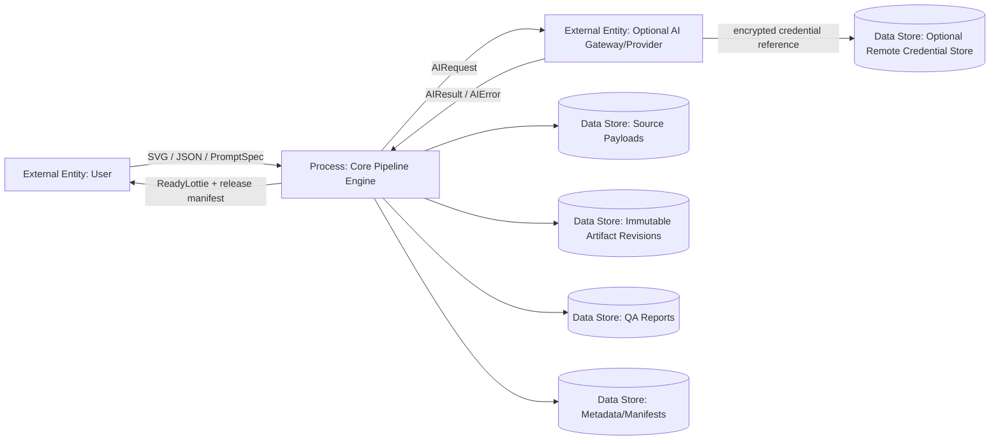

# Core Pipeline Production Specification: Lottie Developer

> Дата: February 2026  
> Версия: 2.0 (production-spec refresh)  
> Аудитория: Product + Engineering  
> Статус: Source of truth для core pipeline

---

## 1. Purpose

Документ описывает реальный production-механизм core pipeline в Lottie Developer.

Цели:

1. Зафиксировать, как входные источники превращаются в release-ready Lottie артефакт через отказоустойчивый и итеративный процесс.
2. Формализовать deterministic quality gates и rollback-механику.
3. Зафиксировать bounded AI integration: AI ускоряет этапы, но не блокирует релиз.

Критичное выравнивание:

1. Onboarding — это demo/concept слой для объяснения пользы и конверсии.
2. Onboarding narrative не является архитектурной правдой core pipeline.

---

## 2. Scope

### In scope

1. Алгоритм и оркестрация production pipeline.
2. Artifact State Machine и правила переходов.
3. Expanded 9-stage pipeline с контрактами этапов.
4. Deterministic quality gates (`Syntax`, `Motion Semantic`, `Runtime`).
5. Bounded retries, rollback и manual fallback.
6. Provider-agnostic AI interface contract.
7. Эксплуатационные guardrails: cost control, SLO, degraded mode.

### Out of scope

1. UI-сториборд и motion-режиссура онбординга.
2. Vendor-specific prompt recipes.
3. Детали backend deployment (infra, CI/CD, ops tooling).
4. Требование реализовать все 9 стадий в одном релизе.

---

## 3. Canonical Data Model (Public Spec Types)

### 3.1 Artifact Types

1. `SourceArtifact`
   - Fields: `source_type`, `payload_ref`, `metadata`
   - Назначение: сырой вход (`svg`, `lottie_json`, `prompt_spec`).
2. `DraftArtifact`
   - Fields: `lottie_json`, `provenance`, `revision_id`
   - Назначение: канонический draft после harmonization/generation.
3. `QAReport`
   - Fields: `syntax_findings`, `motion_findings`, `runtime_findings`, `severity`
   - Назначение: единый формат замечаний по quality gates.
4. `ReadyCandidate`
   - Fields: `revision_id`, `gate_results`, `risk_flags`
   - Назначение: кандидат, прошедший обязательные проверки.
5. `ReadyLottie`
   - Fields: `artifact_ref`, `release_manifest`, `checksum`
   - Назначение: immutable handoff артефакт.

### 3.2 State Machine Types

1. `PipelineStage`
   - Enum с 9 фиксированными стадиями.
2. `StageResult`
   - Values: `pass`, `fail`, `degraded`, `retryable`.
3. `GateResult`
   - Fields: `syntax`, `motion_semantic`, `runtime`.
4. `ArtifactRevision`
   - Fields: `revision_id`, `parent_revision_id`, `lineage`, `diff`, `rollback_pointer`, `created_at`, `actor`.
   - Правило: immutable после сохранения.

### 3.3 Provider-Agnostic AI Contract Types

1. `AIRequest`
   - Fields: `task_type`, `input_ref`, `constraints`, `budget_hint`.
2. `AIResult`
   - Fields: `summary`, `findings`, `patched_json?`, `confidence`, `warnings`, `cost`.
3. `AIError`
   - Values: `timeout`, `quota_exceeded`, `invalid_output`, `provider_unavailable`, `policy_blocked`.
4. `AICapabilities`
   - Fields: `supports_generate`, `supports_patch`, `max_input_size`, `structured_output`.

---

## 4. Pipeline Architecture Model

### 4.1 Core Model

1. Оркестрация: `Artifact State Machine`.
2. Любая трансформация создает новую `ArtifactRevision`.
3. Переходы между стадиями явные и gate-driven.
4. In-place мутация принятых ревизий запрещена.

### 4.2 Multi-Source Canonical Entry

Поддерживаемые входы:

1. `SVG`
2. `Lottie JSON`
3. `Prompt/Spec`

Все типы входов приводятся к `DraftArtifact` до прохождения release gates.

### 4.3 Transition Rules

1. Forward transition разрешен только при выполнении exit criteria стадии.
2. `retryable` ошибки обрабатываются bounded retries.
3. Non-retryable ошибки уходят в manual resolution.
4. Rollback всегда указывает на последнюю валидную immutable revision.

### 4.4 Determinism Rule

Любой AI-assisted output обязан пройти deterministic gates до повышения статуса ревизии.

---

## 5. Expanded 9-Stage Pipeline

## Stage 1: Source Intake

- Input: raw payload (`SourceArtifact`).
- Output: accepted `SourceArtifact` + source metadata.
- Owner: User + App intake validator.
- Entry Criteria: source отправлен в pipeline.
- Exit Criteria: базовая читаемость и размерные ограничения соблюдены.
- Failure Modes: unreadable payload, unsupported format, missing critical metadata.
- Retry Policy: manual resubmit.
- Rollback Point: previous accepted source revision.

## Stage 2: Canonicalization

- Input: accepted `SourceArtifact`.
- Output: canonical intermediate representation.
- Owner: canonicalization engine.
- Entry Criteria: Stage 1 = pass.
- Exit Criteria: source mapped в canonical schema, intent metadata сохранены.
- Failure Modes: unsupported construct, excessive lossy transform.
- Retry Policy: bounded auto-retry parser path, затем manual constraints tweak.
- Rollback Point: Stage 1 revision.

## Stage 3: Draft Generation

- Input: canonical representation.
- Output: `DraftArtifact`.
- Owner: deterministic generator и/или bounded AI assist.
- Entry Criteria: Stage 2 = pass.
- Exit Criteria: draft JSON создан и parseable.
- Failure Modes: generation timeout, invalid draft structure, semantic drift.
- Retry Policy: bounded retries (`N` attempts), затем fallback в deterministic/manual path.
- Rollback Point: last valid canonical revision.

## Stage 4: Syntax Gate

- Input: `DraftArtifact`.
- Output: `GateResult.syntax` + syntax findings.
- Owner: deterministic validator.
- Entry Criteria: Stage 3 produced draft.
- Exit Criteria: schema/required fields/parse integrity = pass.
- Failure Modes: parse error, missing required fields, malformed structure.
- Retry Policy: no blind retries, переход в Stage 7.
- Rollback Point: latest syntax-passing revision.

## Stage 5: Motion Semantic Gate

- Input: syntax-valid draft.
- Output: `GateResult.motion_semantic` + motion findings.
- Owner: semantic analyzer + QA logic.
- Entry Criteria: Stage 4 = pass.
- Exit Criteria: timing/range/loop/intent consistency = pass.
- Failure Modes: loop breakage, keyframe incoherence, intent mismatch.
- Retry Policy: Stage 7 loop, bounded AI analyze/patch допустим.
- Rollback Point: latest motion-semantic-passing revision.

## Stage 6: Runtime Gate

- Input: semantic-valid draft.
- Output: `GateResult.runtime` + runtime findings.
- Owner: runtime playback validation.
- Entry Criteria: Stage 5 = pass.
- Exit Criteria: stable playback, deterministic reopen/replay, import/export reliability.
- Failure Modes: runtime instability, range regression, export mismatch.
- Retry Policy: Stage 7 loop, uncontrolled auto-retries запрещены.
- Rollback Point: latest runtime-passing revision.

## Stage 7: Issue Resolution Loop

- Input: consolidated `QAReport`.
- Output: updated draft revision.
- Owner: User manual path + optional bounded AI assist.
- Entry Criteria: один или больше gate = fail.
- Exit Criteria: новая revision готова к re-gating с Stage 4.
- Failure Modes: regression introduction, low-confidence patch, unresolved critical defects.
- Retry Policy: bounded attempts per issue cluster, затем manual-only path.
- Rollback Point: last gate-passing revision before fix attempt.

## Stage 8: Release Candidate

- Input: revision passed Stages 4-6.
- Output: `ReadyCandidate`.
- Owner: Product/QA decision policy.
- Entry Criteria: все gate statuses = pass.
- Exit Criteria: risk flags accepted, candidate approved.
- Failure Modes: policy mismatch, unresolved risk flags.
- Retry Policy: selective remediation via Stage 7.
- Rollback Point: latest approved candidate revision.

## Stage 9: Publish/Handoff

- Input: approved `ReadyCandidate`.
- Output: `ReadyLottie` + `release_manifest` + checksum.
- Owner: publish/handoff actor.
- Entry Criteria: Stage 8 approved.
- Exit Criteria: immutable final artifact published/shared.
- Failure Modes: checksum mismatch, manifest inconsistency, handoff target failure.
- Retry Policy: bounded publish retries, затем rollback к Stage 8 artifact.
- Rollback Point: `ReadyCandidate` revision.

---

## 6. Optional AI Branch (Assistive + Bounded)

### 6.1 AI Role

1. AI — optional accelerator, не обязательный orchestrator.
2. Разрешенные task types: `generate`, `analyze`, `patch`.
3. AI разрешен только в Stage 3 и Stage 7.

### 6.2 Deterministic Safety Rules

1. AI output не может быть promoted напрямую в release stages.
2. Любой AI output проходит Stage 4 -> Stage 5 -> Stage 6.
3. `invalid_output` и low-confidence output автоматически отклоняются.

### 6.3 Fallback Behavior

1. При `timeout` / `provider_unavailable` / `quota_exceeded` pipeline продолжается без потери state.
2. Last valid revision остается rollback anchor.

---

## 7. Quality Gates

## 7.1 Syntax Gate

Checks:

1. JSON parse integrity.
2. Required structural fields.
3. Schema/type consistency.
4. Corruption checks.

## 7.2 Motion Semantic Gate

Checks:

1. Timing consistency.
2. Playback range coherence.
3. Loop semantics correctness.
4. Visual intent preservation.

## 7.3 Runtime Gate

Checks:

1. Stable playback на target speed presets.
2. Deterministic preview при reopen/replay.
3. Import/export reliability.
4. Absence of critical runtime artifacts.

---

## 8. Failure Handling and Recovery

### 8.1 Bounded Retries

1. Conversion и AI operations используют только bounded retries.
2. Retry budget finite и stage-specific.
3. При исчерпании бюджета включается deterministic fallback.

### 8.2 Rollback

1. Rollback target — всегда immutable prior revision.
2. Failed revisions не удаляются; lineage остается auditable.

### 8.3 Manual Resolution Path

1. Если retries exhausted или policy blocked automation, pipeline уходит в manual resolution (Stage 7).
2. Manual path сохраняет все revision references.

---

## 9. Economic Safety (Indie Constraints)

### 9.1 Operating Principles

1. v1: `BYO key only`.
2. Core pipeline fully usable without AI.
3. AI path не должен блокировать выпуск non-AI workflows.

### 9.2 Cost Guardrails

1. Hard per-user quotas.
2. Hard global budget cap.
3. Soft alerts at 50% / 80% / 95%.
4. Forced AI-path stop on hard cap breach.

---

## 10. SLO and Performance

1. Interactive AI target: `P95 <= 12s`.
2. При нарушении SLO система входит в `degraded mode`.
3. Degraded mode behavior:
   - explicit latency warning,
   - offline/manual fallback recommendation,
   - current revision stability guarantee.

---

## 11. Provider-Agnostic Interface Contract

### 11.1 Contract Goals

1. Изолировать core pipeline от vendor-specific особенностей.
2. Обеспечить adapter swapability без redesign pipeline.

### 11.2 Contract Surface

1. Normalized envelopes: `AIRequest`, `AIResult`.
2. Normalized error taxonomy: `AIError`.
3. Explicit capability declaration: `AICapabilities`.

### 11.3 Non-Goals

1. No vendor-specific prompt DSL in core spec.
2. No vendor-specific auth flow details in core spec.

---

## 12. Pipeline Diagram (State Machine)

---

## 13. DFD (High Level)

---

## 14. Consequences

### Pros

1. Переиспользуемая архитектура для разных source types.
2. Отказоустойчивый прогресс через bounded retries + explicit rollback.
3. AI acceleration без AI lock-in.
4. Строгие gate contracts повышают предсказуемость QA.

### Cons

1. State-machine orchestration сложнее линейного flow.
2. Поддержка строгих контрактов увеличивает governance overhead.
3. Revision lineage и gate metrics требуют операционной дисциплины.

### Trade-off Summary

Модель сознательно выбирает release safety и extensibility вместо минимальной начальной простоты.

---

## 15. Migration Note

1. Текущий runtime JSON-first path — это допустимый частный случай multi-source модели.
2. Немедленная реализация всех 9 стадий не требуется.
3. Документ — north-star для итеративной поставки.

---

## 16. Acceptance Scenarios (Production)

### Scenario A: Offline-only Path

1. User импортирует source.
2. Deterministic stages формируют и валидируют draft.
3. Candidate approved и published без AI.

### Scenario B: AI Generate Path

1. Draft создается через bounded AI assist в Stage 3.
2. Draft проходит все deterministic gates.
3. Candidate approved и published.

### Scenario C: AI Patch Path

1. Gate failure отправляет flow в Stage 7.
2. AI patch помогает исправить issues.
3. Patched revision re-enters Stage 4 и проходит gates.

### Scenario D: AI Failure + Rollback Path

1. AI operation fails (`timeout`/`provider_unavailable`/`invalid_output`).
2. Pipeline откатывается к last valid revision.
3. User продолжает deterministic/manual resolution.

### Scenario E: Quota/SLO Degraded Path

1. Hard quota reached или SLO degraded.
2. AI path stopped/limited.
3. Pipeline продолжается через offline/manual deterministic path.

---

## 17. Glossary

1. `Canonicalization` — normalization heterogeneous sources into canonical representation.
2. `Gate` — deterministic validation checkpoint.
3. `Revision` — immutable artifact snapshot with lineage.
4. `Rollback` — pointer-based return to last valid immutable revision.
5. `Degraded Mode` — reduced behavior under SLO/availability pressure.
6. `Capability Contract` — provider-agnostic AI adapter capabilities.
7. `Bounded Retry` — finite retry budget.
8. `Deterministic Path` — non-AI rule-based execution route.

---

## 18. Verification Checklist for This Document

1. У каждой из 9 стадий есть `Input/Output/Owner/Entry/Exit/Failure/Retry/Rollback`.
2. Переходы в диаграммах совпадают с текстовыми transition rules.
3. AI остается assistive; mandatory AI dependency отсутствует.
4. Любой AI output проходит `Syntax -> Motion Semantic -> Runtime`.
5. Rollback/fallback явно зафиксирован для timeout/quota/invalid output.
6. Cost guardrails включают hard caps и 50/80/95 alerts.
7. SLO `P95 <= 12s` и degraded mode описаны недвусмысленно.
8. Provider contract остается vendor-agnostic.
9. Термины из glossary используются консистентно.
10. Онбординг явно отмечен как demo layer, а не архитектурная истина.

---

## 19. Fixed Assumptions and Defaults

1. Source of truth: production pipeline, not onboarding narrative.
2. Orchestration model: `Artifact State Machine`.
3. Input model: multi-source canonical (`SVG`, `JSON`, `Prompt/Spec`).
4. Granularity: expanded 9-stage pipeline.
5. AI role: assistive + bounded.
6. Quality gates: `Syntax + Motion Semantic + Runtime`.
7. Failure strategy: bounded retries + rollback.
8. Provider model: explicit provider-agnostic contract.
9. Interactive AI SLO: `P95 <= 12s`.
10. v1 economy: `BYO key only + hard quotas + soft alerts`.
11. Artifact versioning: immutable revisions.
